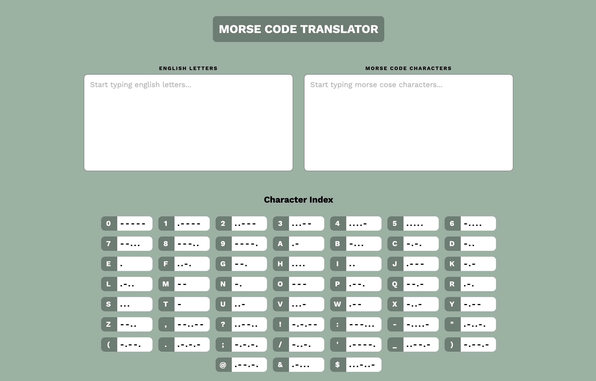

# Morse Code Translater

Welcome! This web app is a simple Morse Code Translator that allows users to translate between English and Morse code in real-time. The site also features an index of accepted characters to make things easier for anyone unfamiliar with morse code.

[Vire the live site](https://morse-code-translator-ten.vercel.app/)

## Key Features

-   **Real Time Translation**: The text you enter is translated as you type!

-   **Two-Way Translation**: The app supports entry of both English or Morse-Code, with both being translated to the other (From English to Morse and from Morse to English)

-   **Case Handling**: When a new sentence is started the word will be returned with the first letter of the sentence being capitalised, as is convention in English.

## Technologies Used

-   HTML
-   SCSS & BEM for styling
-   Jest for testing

## Installation

1. First clone the repository by entering the following into your terminal:

```bash
git clone https://github.com/kvtrice/morse-code-translator.git
```

2. Access the `morse-code-translator` folder:

```bash
cd morse-code-translator
```

3. Install the necessary dependencies:

```bash
npm i
```

## Testing

To run the jest test, run the following command whilst in the same directory:

```bash
npm run test
```
